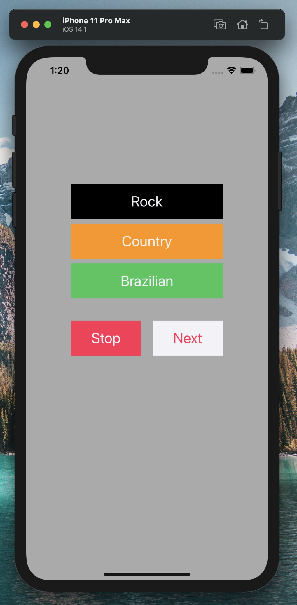

# OVERVIEW

This is an idea of a Music App project using Swift. It is basic but it helped to understand how Swift is supposed to work.
The app will search for songs in your iPhone music's list that match with the genre option tapped by the user.

## Development Environment

* XCode 12
* Swift
* Macbook Pro

## Execution

It is required to have a machine running MacOS and install XCode. While running the project in XCode, select the type of iPhone you would like
to emulate and use the app. After getting the app running, the user will select one of the given options of music genres. The
app will look for songs that matches the selected genre and play. The app provides buttons to stop the music and to go to the
next one.

